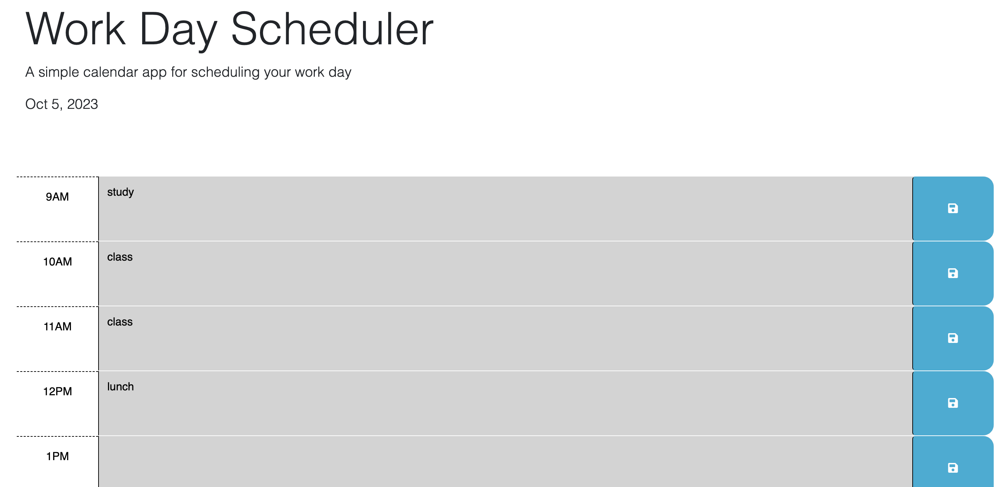

# work-day-scheduler

## Technology Used 

HTML, 
CSS, 
JAVASCRIPT,
Third Party APIs

## Description 

[Visit the Deployed Site](https://abenedetti27.github.io/work-day-scheduler/)

When using the daily planner to create a schedule, the current day is displayed at the top of the calendar and the user is presented with time blocks for standard business hours of 9am to 5pm. Each time block is color-coded to indicate whether it is in the past, present, or future. The user can enter an event and click the save button for that time block
and the text for that event is saved in local storage. When the user refreshes the page, the saved events persist.

## JAVASCRIPT Example


```JS
var currentHour = dayjs().format('H');
console.log("current hour",currentHour)
$('.time-block').each(function() {
  var timeBlockHour = parseInt($(this).attr('id').split('-')[1]);
  console.log(timeBlockHour)
  if (timeBlockHour < currentHour){
    $(this).addClass('past').removeClass('present future');
  }
  else if (timeBlockHour === currentHour) {
  
    $(this).addClass('present').removeClass('past future');
} else {
    $(this).addClass('future').removeClass('past present');
}
});

```




## License

MIT License

Copyright (c) [2023] [Anna Rose Benedetti]

